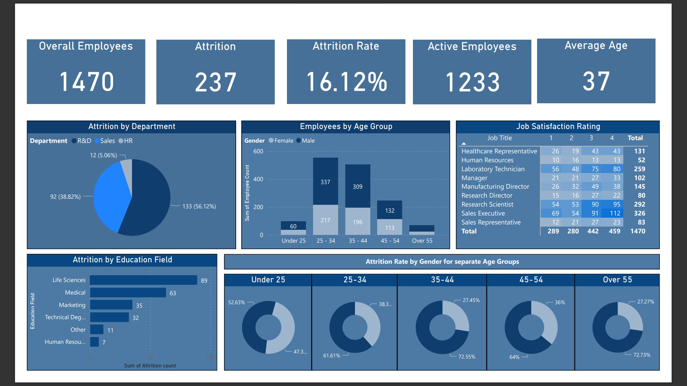

This is short project completed to analyze HR data to help the department to monitor and manage different aspects of employee data to maintain a healthy workforce.

<!--more-->

Several KPIs are used to address different points

1. Employee count: How many employee are in the workforce? If this number is not clear then it is difficult to assess the size of the workforce to determine future growth or downsizing.
2. Attrition count: Currently the data does not show how many employees have left the organization so this needs to be standardized
3. Attrition Rate: Without a clear measure of rate or attrition count, we cannot assess the overall turnover rate and compare it with other similar companies in the industry
4. Active employees: Need a way to measure the active and inactive employees so that productivity can be measured.
5. Average Age: This would evaluate the workforce demographics and the company's ability to attract and retain talent of different ages.

You can visit the PowerBI file with the data and the dashboard here, by visiting [this repository](https://github.com/cwathen/PowerBi)

--------
